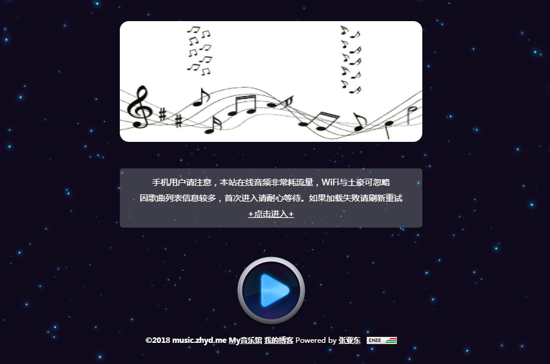
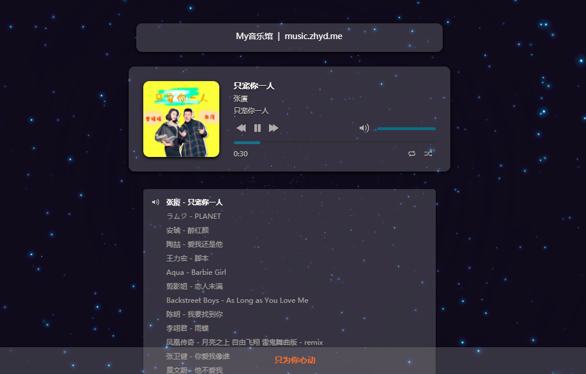

# DMusic

DMusic是使用Springboot开发的、下载即可用、简单大气上档次的个人音乐博客 [网站预览](http://music.zhyd.me)，没有之一！

## 页面预览

## 生命不息，折腾不止！
## 更多信息，请关注：
1. [我的博客](https://www.zhyd.me)
2. [我的微博](http://weibo.com/211230415)
3. [我的头条号](http://www.toutiao.com/c/user/3286958681/)
4. [我的mooc](http://www.imooc.com/u/1175248/articles)

## 有任何问题可以
- [给我留言](https://www.zhyd.me/guestbook)

## 特别声明：
1. 本源代码不用于任何商业途径，不收任何费用，只用于技术学习探讨，旨在与有共同爱好的朋友交流，交流QQ群：190886500。
2. 如因违反第一条声明所造成的任何问题，本人不负任何责任。
3. 如果您已经使用本源代码用于任何非法行为，本人不负任何责任，请遵守相关法津法规，将技术用于有用之处。
4. 使用过程中有任何项目有关的问题，欢迎进群讨论！
